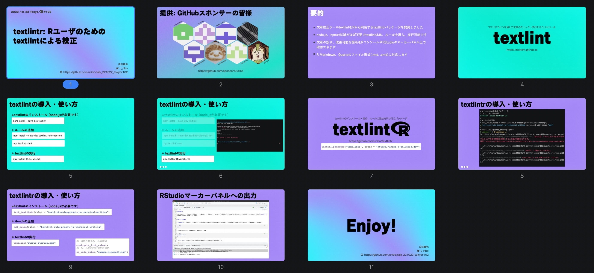

textlintr: Rユーザのためのtextlintによる校正
================

2022年10月22日開催の[Tokyo.R#102](https://tokyor.connpass.com/event/262836/)でのLT発表資料です。

## スライド

Speakerdeck: https://speakerdeck.com/s_uryu/20221022-textlintr
PDF: [slide.pdf](https://github.com/uribo/talk_221022_tokyor102/blob/main/slide.pdf)



## カラーパレット

```r
scales::show_col(c("#12e6c8", "#a287f4", "#414141", "#000000"), ncol = 4, borders = FALSE)
```

## リンク

- [textlint](https://textlint.github.io)
- [textlintr](https://github.com/uribo/textlintr)
